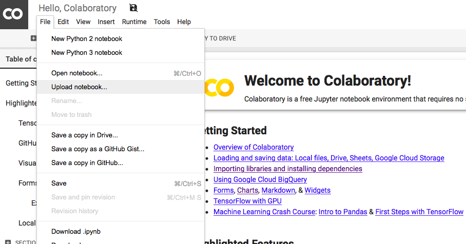
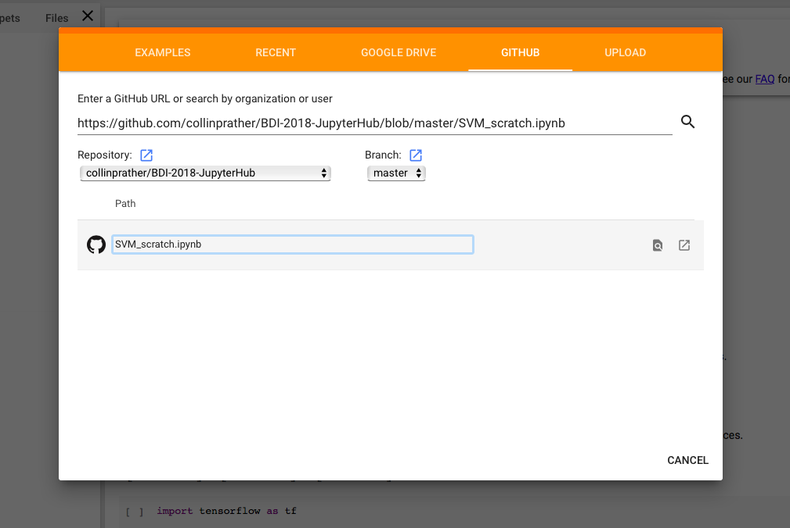

# Big Data Ignite Conference 2018
# *Machine Learning from Scratch*

## Getting Set-up
Welcome BDI 2018 attendees! If you're here at my talk, *Machine Learning from Scratch*, then you've come to the right place. I've prepared a jupyter notebook with some starter code to follow along with. If you already have Anaconda installed on your computer, please feel free to download or clone the notebook [here, (add link to notebook!)](), and run it on your own machine. If not, there are two simple ways to access and execute the code straight from your browser.

### Option 1: Google Colab
1. head to [colab.research.google.com](colab.research.google.com). 
2. Once the notebook loads, in the top left corner, click `file`, choose `upload notebook`

    

3. In the panel across the top, click `GITHUB`, then paste the following link in the search bar: `https://github.com/collinprather/BDI-2018-JupyterHub/blob/master/SVM_scratch.ipynb`

    

4. Click on the `SVM_scratch.ipynb` notebook, and wait for you notebook to load. You should be all set to start executing your code!

### Option 2: mybinder.org
[Binder](https://mybinder.org) is powered by [Docker](https://www.docker.com) and [JupyterHub](https://jupyterhub.readthedocs.io/en/stable/). It allows you to run code in a notebook without any installation whatsoever. If you're willing to wait about 3-5 minutes for it to load, it gives you a true Jupyter feeling notebook (Google's colab just feels a bit different.)

The JupyterHub for our repowill be launched by clicking the following "badge":  

*note: Insert a link to the original dataset and possibly my notebooks where I perform my analysis